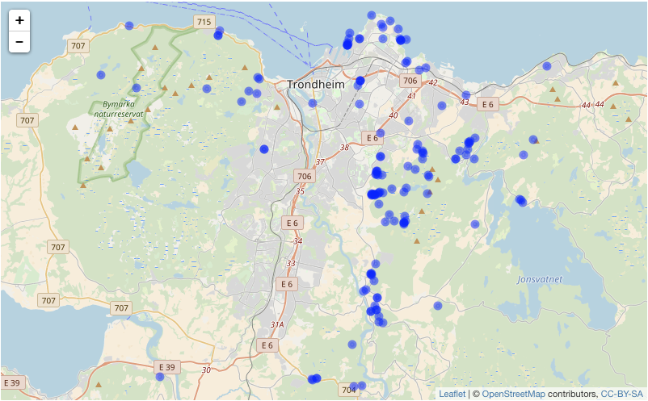

# Nordic Oikos 2018 - R workshop

Scientific reuse of openly published biodiversity information: Programmatic access to and analysis of primary biodiversity information using R. Nordic Oikos 2018, pre-conference R workshop, 18 and 19 February 2018. Further information [here](http://www.gbif.no/events/2018/Nordic-Oikos-2018-R-workshop.html).

Here are some basic examples of accessing GBIF data from R using the [rgbif](https://www.gbif.org/tool/81747/rgbif) [package](https://cran.r-project.org/web/packages/rgbif/index.html) from [rOpenSci](https://ropensci.org/).


```r
# Setting the working directory, here: to the same directory as the RMD-script
# Notice that eval=FALSE will exclude execution of this chunk in knitr, but enable manual execution in RStudio
setwd(dirname(rstudioapi::getActiveDocumentContext()$path))
getwd() ## will display the working directory
```

## Choose a species name

```r
require(rgbif) # r-package for GBIF data
kingdom <- "Plantae"
sp_name <- "Hepatica nobilis" # liverleaf (blaaveis:no)
#sp_name <- "Hordeum vulgare" # barley (bygg:no)
key <- name_backbone(name=sp_name, kingdom="Plantae")$speciesKey
```

## Retrieve species occurrence data from GBIF

```r
require(rgbif) # r-package for GBIF data
sp <- occ_search(taxonKey=key, return="data", hasCoordinate=TRUE, limit=300) 
gbifmap(sp)
```

<!-- -->

## Example - GBIF data from Trondheim
Species is *Hepatica nobilis* with taxonKey **5371699**

```r
require(rgbif) # r-package for GBIF data
require("mapr") # rOpenSci r-package for mapping (occurrence data)
bbox <- c(10.2,63.3,10.6,63.5) # Trondheim
#bbox <- c(5.25, 60.3, 5.4, 60.4) # Bergen
#bbox <- c(18.7, 69.6, 19.2, 69.8) # Tromsoe
#bbox <- c(10.6, 59.9, 10.9, 60.0) # Oslo
sp_bb <- occ_search(taxonKey=key, return="data", hasCoordinate=TRUE, country="NO", geometry=bbox, limit=300) 
map_leaflet(sp_bb, "decimalLongitude", "decimalLatitude", size=3, color="blue")
```



## Extract coordinates suitable for e.g. Maxent

```r
xy <- sp[c("decimalLongitude","decimalLatitude")] ## Extract only the coordinates
sp_xy <- sp[c("species", "decimalLongitude","decimalLatitude")] ## Input format for Maxent
#structure(sp_xy) ## preview the list of coordinates
head(sp_xy, n=5) ## preview first 5 records
```

```
## # A tibble: 5 x 3
##            species decimalLongitude decimalLatitude
##              <chr>            <dbl>           <dbl>
## 1 Hepatica nobilis       -80.363982        43.30512
## 2 Hepatica nobilis         9.695950        45.71975
## 3 Hepatica nobilis       -72.735224        41.26291
## 4 Hepatica nobilis         8.187178        45.16391
## 5 Hepatica nobilis       -88.427528        41.86515
```

## Write dataframe to file (useful for Maxent etc)

```r
write.table(sp_xy, file="../demo_data/sp_xy.txt", sep="\t", row.names=FALSE, qmethod="double") ## for Maxent
```

## Read data file back into R

```r
#rm(sp_xy) ## remove vector sp_xy from the R workspace environment, before re-loading
#sp_xy <- read.delim("./sp_xy.txt", header=TRUE, dec=".", stringsAsFactors=FALSE)
```

GBIF demo examples for species: *Hepatica nobilis* (taxonKey:5371699).

This script uses [R Markdown](http://rmarkdown.rstudio.com/)
