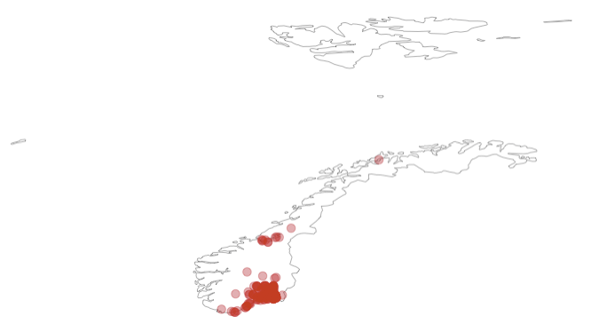
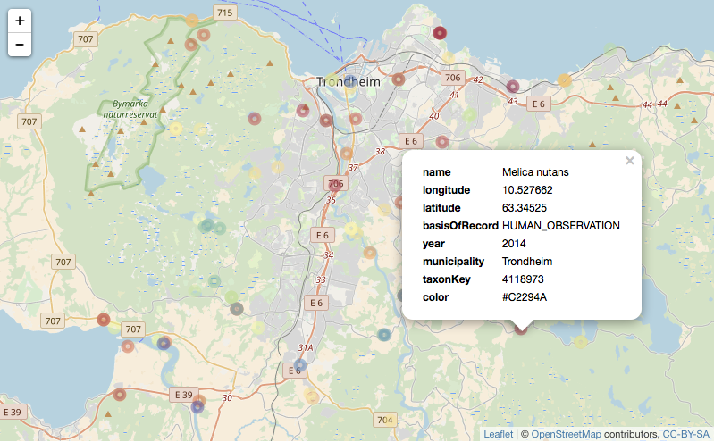

***

You are here: [R workshop](../) >> [Session 3 GBIF data](./) >> **rgbif demo**


***

# Nordic Oikos 2018 - R workshop - Session 3

Scientific reuse of openly published biodiversity information: Programmatic access to and analysis of primary biodiversity information using R. Nordic Oikos 2018, pre-conference R workshop, 18<sup>th></sup> and 19<sup>th</sup> February 2018. Further information [here](http://www.gbif.no/events/2018/Nordic-Oikos-2018-R-workshop.html).


**Session 3** includes examples of accessing GBIF data from R using the [rgbif](https://www.gbif.org/tool/81747/rgbif) [package](https://cran.r-project.org/web/packages/rgbif/index.html) from [rOpenSci](https://ropensci.org/).

***

### Choose a species name

```r
require(rgbif) # r-package for GBIF data
sp_name <- "Hepatica nobilis"; kingdom <- "Plantae" # liverleaf (blaaveis:no), taxonKey=5371699
#sp_name <- "Hordeum vulgare"; kingdom <- "Plantae" # barley (bygg:no)
#sp_name <- "Pinus sylvestris L"; kingdom <- "Plantae" # scots pine (furu:no), taxonKey=5285637
#sp_name <- "Picea abies (L.) H. Karst"; kingdom <- "Plantae" # Norway spruce (gran:no), taxonKey=5284884
#sp_name <- "Juniperus communis L."; kingdom <- "Plantae" # common juniper (einer:no), taxonKey=2684709
#sp_name <- "Salmo trutta"; kingdom <- "Animalia" # trout (oerret:no)
#sp_name <- "Parus major Linnaeus"; kingdom <- "Animalia" # great tit (kjoettmeis:no), taxonKey=8095051
#sp_name <- "Cycladophora davisiana Ehrenberg"; kingdom <- "Chromista" # radiolaria sp., taxonKey=5955869
key <- name_backbone(name=sp_name, kingdom=kingdom)$speciesKey
```

### You may also use a higher level group (with a taxonKey)

```r
nub <- 'd7dddbf4-2cf0-4f39-9b2a-bb099caae36c'; sp_name <- NULL # GBIF NUB taxon backbone datasetKey
#sp_name <- "Plantae";      rank <- "KINGDOM" # plants, taxonKey=6
#sp_name <- "Tracheophyta"; rank <- "PHYLUM"  # vascular plants, taxonKey=7707728
sp_name <- "Poaceae";      rank <- "FAMILY"  # grasses, taxonKey=3073
#sp_name <- "Aves";         rank <- "CLASS"   # birds, taxonKey=212
key <- name_lookup(query=sp_name, rank=rank, datasetKey=nub, limit=1)$data$key # find taxonKey
```
Choose a rank among: CLASS, CULTIVAR, CULTIVAR_GROUP, DOMAIN, FAMILY, FORM, GENUS, INFORMAL, INFRAGENERIC_NAME, INFRAORDER, INFRASPECIFIC_NAME, INFRASUBSPECIFIC_NAME, KINGDOM, ORDER, PHYLUM, SECTION, SERIES, SPECIES, STRAIN, SUBCLASS, SUBFAMILY, SUBFORM, SUBGENUS, SUBKINGDOM, SUBORDER, SUBPHYLUM, SUBSECTION, SUBSERIES, SUBSPECIES, SUBTRIBE, SUBVARIETY, SUPERCLASS, SUPERFAMILY, SUPERORDER, SUPERPHYLUM, SUPRAGENERIC_NAME, TRIBE, UNRANKED, VARIETY

### Species occurrence data from GBIF

```r
require(rgbif) # r-package for GBIF data
sp <- occ_search(taxonKey=key, return="data", hasCoordinate=TRUE, limit=100) 
gbifmap(sp)
```


***

### Preview of dataframe with search results

```r
head(sp, n=5) ## preview first 5 records
```
')

***

### Extract coordinates suitable for e.g. Maxent

```r
xy <- sp[c("decimalLongitude","decimalLatitude")] ## Extract only the coordinates
sp_xy <- sp[c("species", "decimalLongitude","decimalLatitude")] ## Input format for Maxent
# structure(sp_xy) ## preview the list of coordinates
head(sp_xy, n=5) ## preview first 5 records
```


### Write dataframe to file (useful for Maxent etc.)

```r
#write.table(sp_xy, file="./demo_data/sp_xy.txt", sep="\t", row.names=FALSE, qmethod="double") ## for Maxent
readLines("./demo_data/sp_xy.txt", n=10)
#readChar("./demo_data/sp_xy.txt", file.info("./demo_data/sp_xy.txt")$size) ## Alternative preview
```


### Read data file back into R

```r
#rm(sp_xy) ## remove vector sp_xy from the R workspace environment, before re-loading
#sp_xy <- read.delim("./demo_data/sp_xy.txt", header=TRUE, dec=".", stringsAsFactors=FALSE)
#head(sp_xy, n=5) ## preview first 5 records
```

***

### GBIF data from Norway



***

### GBIF data from Trondheim (or aother bounding box)


### Preview data frame

```r
head(sp_bb, n=5) ## preview first 5 records
#head(sp_bb_m, n=5) ## preview first 5 records
```


### Mapping with leaflet

```r
library("mapr") # rOpenSci r-package for mapping (occurrence data)
#library("spocc") # rOpenSci r-package with more biodiversity data sources than GBIF
map_leaflet(sp_bb_m, "decimalLongitude", "decimalLatitude", size=2, color="blue")
```


***

### Make a simple map of 4 spring flower species (in Norway)

```r
## liverleaf, wood anemone, dandelion, red clover
spp_names <- c('Hepatica nobilis', 'Anemone nemorosa', 'Taraxacum officinale', 'Trifolium pratense')  
keys <- sapply(spp_names, function(x) name_backbone(name=x, kingdom='plants')$speciesKey, USE.NAMES=FALSE)
spp <- occ_search(taxonKey=keys, limit=100, return='data', country='NO', hasCoordinate=TRUE) ## return list
library('plyr') ## r-pkg plyr for splitting, applying and combining data
spp_df <- ldply(spp) ## ldply - split list, apply function, return dataframe (here list to df)
#gbifmap(spp_df, region='norway') ## Alternative simpler map
spp_m <- spp_df[c("name", "decimalLongitude","decimalLatitude", "basisOfRecord", "year", "municipality")]
cols <- c('blue', '#dddddd', 'yellow', 'red')
map_leaflet(spp_m, "decimalLongitude", "decimalLatitude", size=3, color=cols)
```


***

(Dag: I might want to move color ramp into separate Rmd script...)

***

### Expand color-ramp when mapping many species
Notice that colors will not be easy to distinguish when number of species is high. Standard color-ramps include 9-12 colors.

```r
## Poaceae has taxonKey=3073 - which gives us multiple species (here 31 unique "names", 33 unique "taxonKey")
bb_t <- c(10.2,63.3,10.6,63.5) ## Trondheim
spp_t <- occ_search(taxonKey='3073', limit=100, return='data', country='NO', geometry=bb_t, hasCoordinate=TRUE)
spp_t_m <- spp_t[c("name", "decimalLongitude","decimalLatitude", "basisOfRecord", "year", "municipality", "taxonKey")]
```


```r
## The default color-ramp (Set1) has 9 colors and cause a warning message when more than 9 species are included in the same map.
library('mapr') # rOpenSci r-package for mapping (occurrence data)
library('spocc') # rOpenSci r-package with more biodiversity data sources than GBIF
library('RColorBrewer')
library('plotly')
n_spp <- length(unique(spp_t_m$name)) # number of unique taxa in dataframe (USE spp$name, NOT spp$taxonKey)
myColors <- colorRampPalette(brewer.pal(11,"Spectral"))(n_spp) # create color palette with [n_spp] colors
#myColors <- colorRampPalette(brewer.pal(9,"Set1"))(n_spp) # create color palette with [n_spp] colors
#myColors <- rainbow(length(unique(spp_t_m$name))) # create color palette with [n_spp] colors
map_leaflet(spp_t_m, "decimalLongitude", "decimalLatitude", size=5, color=myColors)
```



### Diverse color palettes


```r
library(RColorBrewer)
#display.brewer.all()
display.brewer.pal(n=9, name='Set1')
```

Read more about colors at the [https://www.r-bloggers.com/palettes-in-r/](R-bloggers story about color palettes in R)

***

