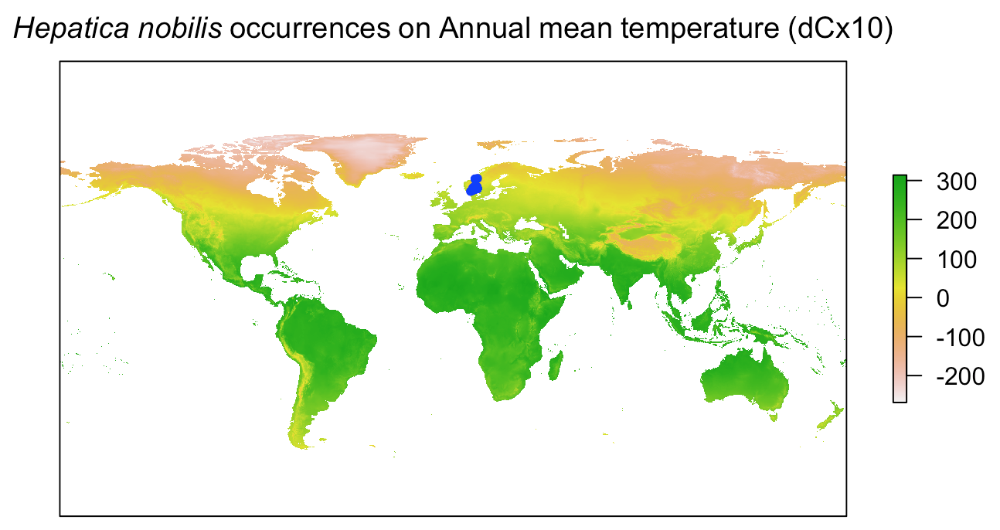

***

# Nordic Oikos 2018 - R workshop - Session 5

Scientific reuse of openly published biodiversity information: Programmatic access to and analysis of primary biodiversity information using R. Nordic Oikos 2018, pre-conference R workshop, 18<sup>th</sup> and 19<sup>th</sup> February 2018 in Trondheim. Further information [here](http://www.gbif.no/events/2018/Nordic-Oikos-2018-R-workshop.html).

Session 5 focus on linking GBIF data with environment layers, using the [Raster R-package](https://cran.r-project.org/web/packages/raster/index.html) and other tools.

***

### GBIF data for taxon liverleaf (bl&aring;veis:no)

```r
require('rgbif') # r-package for GBIF data
sp_name <- "Hepatica nobilis"; kingdom <- "Plantae" # liverleaf (blaaveis:no), taxonKey=5371699
key <- name_backbone(name=sp_name, kingdom=kingdom)$speciesKey
sp <- occ_search(taxonKey=key, return="data", hasCoordinate=TRUE, country="NO", limit=100)
sp_m <- sp[c("name", "catalogNumber", "decimalLongitude","decimalLatitude", "basisOfRecord", "year", "municipality", "taxonKey", "occurrenceID")] ## Subset columns
#gbifmap(sp, region = "norway")
#map_leaflet(sp_m, "decimalLongitude", "decimalLatitude", size=2, color="blue")
```

***

### Read example species occurrence data into R
You may of course choose your own species data or other study areas following the examples provided in [session 3](../s3_gbif_demo).

```r
sp <- read.delim("./demo_data/sp.txt", header=TRUE, dec=".", stringsAsFactors=FALSE)
#sp_xy <- read.delim("./demo_data/sp_xy.txt", header=TRUE, dec=".", stringsAsFactors=FALSE)
#head(sp_xy, n=5) ## preview first 5 records
```

### Extract coordinates suitable for e.g. Maxent

```r
xy <- sp[c("decimalLongitude","decimalLatitude")] ## Extract only the coordinates
sp_xy <- sp[c("species", "decimalLongitude","decimalLatitude")] ## Input format for Maxent
#write.table(sp_xy, file="./demo_data/sp_xy.txt", sep="\t", row.names=FALSE, qmethod="double") ## for Maxent
#write.table(sp, file="./demo_data/sp.txt", sep="\t", row.names=FALSE, qmethod="double") ## dataframe
#readLines("./demo_data/sp_xy.txt", n=10)
```

***

# Read environment layer from WorldClim into R
[Worldclim](http://worldclim.org/) information about the [bioclim variables](http://worldclim.org/bioclim)
Citation: Fick, S.E. and R.J. Hijmans, 2017. Worldclim 2: New 1-km spatial resolution climate surfaces for global land areas. *International Journal of Climatology* 37: 4302–4315. DOI:10.1002/joc.5086

### Download and load bioclim layers from WorldClim
Data source worldclim requires variables "var", "res", and if res=0.5 also "lon" and "lat":

 * var = bio, tmin, tmax, tavg, prec, srad, wind, or vapr. [More information](http://worldclim.org/version2).
 * res = "10" minutes (ca 18.5km), "5" min (ca 9.3km), "2.5" min (ca 4.5km), "0.5" 30 arc-seconds (ca 1km)
 * lon = [longitude], lat = [latitude], as integer coordinate-values somewhere inside the tile that you want

**NB! finer resolution will cause very large Internet download, and cache large files locally!**


```r
require(raster) # spatial raster data management, works well with dismo
env <- getData('worldclim', var='bio', res=10) # 10 degree grid (approx 18.5 km, 342 km2 at equator) 85 MByte
#env <- getData('worldclim', var='bio', res=5) # 5 degree grid (approx 9.3 km, 86 km2) 296 MByte
#env <- getData('worldclim', var='bio', res=2.5) # 2.5 degree grid (approx 4.5 km, 20 km2) 1.3 GByte
#env <- getData('worldclim', var='bio', res=0.5, lon=10, lat=63) # 30 arc-second grid (approx 1 km)
```

***

### Plot environment layers and species occurrences on a map


```r
plot(env, 1, main=NULL, axes=FALSE) ## could add title here with main="Title"
title(main = bquote(italic(.(sp_name)) ~occurrences~on~Annual~mean~temperature~'(dCx10)'))
points(xy, col='blue', pch=20) # plot species occurrence points to the map
```


***

### Extract climate data for species occurrence points

```r
xy_bio <- extract(env, xy); # extract environment to points (pkg raster)
head(xy_bio, n=5) ## preview first 5 records
write.table(xy_bio, file="./demo_data/xy_bio.txt", sep="\t", row.names=FALSE, col.names=TRUE, qmethod="double")
#xy_bio <- read.delim("./demo_data/xy_bio.txt", header=TRUE, dec=".", stringsAsFactors=FALSE) ## dataframe
```


```r
sp_m_bio <- cbind(sp_m, xy_bio) # generating output file
head(sp_m_bio, n=5) ## preview first 5 records
write.table(sp_m_bio, file="./demo_data/sp_bio.txt", sep="\t", row.names=FALSE, col.names=TRUE, qmethod="double")
#sp_m_bio <- read.delim("./demo_data/sp_bio.txt", header=TRUE, dec=".", stringsAsFactors=FALSE) ## dataframe
```


***

### Size of environment layer can be LARGE if using the finer resolutions


```r
#object.size(env) ## read the space allocated in memory for an environment variable
#format(object.size(env), units = "auto") ## Auto reports multiples of 1024
#format(object.size(env), units = "auto", standard = "SI") ## SI use multiples of 1000
cat("Size of env =", format(object.size(env), units = "auto")) ## Auto reports multiples of 1024
#rm(env) ## save memory - especially useful if using finer resolutions
```

Size of env = 235.5 Kb

***

### The BioClim layers:

 * BIO1 = Annual Mean Temperature
 * BIO2 = Mean Diurnal Range (Mean of monthly (max temp – min temp)) 
 * BIO3 = Isothermality (BIO2/BIO7) (* 100)
 * BIO4 = Temperature Seasonality (standard deviation *100)
 * BIO5 = Max Temperature of Warmest Month
 * BIO6 = Min Temperature of Coldest Month
 * BIO7 = Temperature Annual Range (BIO5-BIO6)
 * BIO8 = Mean Temperature of Wettest Quarter
 * BIO9 = Mean Temperature of Driest Quarter
 * BIO10 = Mean Temperature of Warmest Quarter 
 * BIO11 = Mean Temperature of Coldest Quarter 
 * BIO12 = Annual Precipitation
 * BIO13 = Precipitation of Wettest Month
 * BIO14 = Precipitation of Driest Month
 * BIO15 = Precipitation Seasonality (Coe cient of Variation) 
 * BIO16 = Precipitation of Wettest Quarter
 * BIO17 = Precipitation of Driest Quarter
 * BIO18 = Precipitation of Warmest Quarter
 * BIO19 = Precipitation of Coldest Quarter

***
